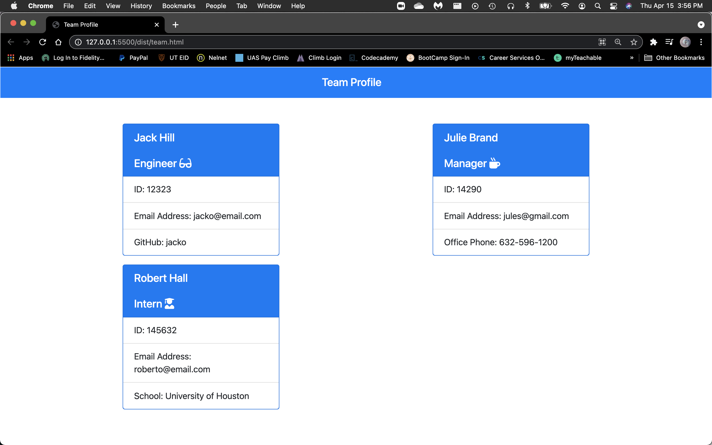

# Team Profile Generator - TPG

## Summary
TPG is a command line application that prompts the user through a series of questions to create a team profile with each member and specific information about their role. Once the user completes the prompts, an html template is created to display each member card with the following information:
* Team member name
* Team member role
* Team member email address
* Specific information based on role
  * Engineer role
    * Github Username
  * Intern role 
    * School
  * Manager role 
    * Office phone number

## Walk-through [Video](https://drive.google.com/file/d/110YCX_-Wqn520Xa7fZB8FTQ0Z4SQEWMc/view)

## Sample

## Technologies
* [Node.js](https://nodejs.org/en/)
* [jest](https://www.npmjs.com/package/jest)
* [inquirer](https://www.npmjs.com/package/inquirer)